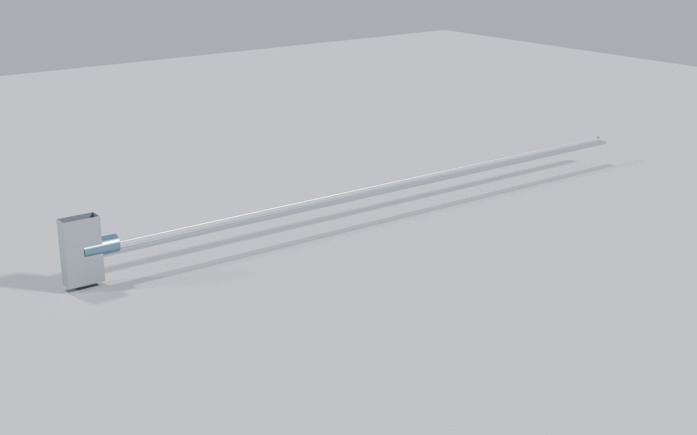

> ## What is generated here, and what is not
>
> **Generated** from [aaaaaaaaaaaavm/VOLLEY](https://github.com/aaaaaaaaaaaavm/VOLLEY) at commit
> `23b7e03` by `tools/export_companion.py`: the analysis scripts and their results, the
> validation run sheets, the figures, and the reference records. Any edit to those is
> destroyed on the next export. **Fix them in VOLLEY and this repository picks the fix up.**
>
> **Authored here, and never overwritten:** the manuscript and its figures under `source/`, and everything under `university/`. VOLLEY is an engineering
> record and holds no manuscript source.
>
> Where a generated file disagrees with VOLLEY, VOLLEY is right and this copy is stale.
>
> **This repository may be improved until the work is presented, and freezes at that
> moment.** What enters it has to be stable, effective and reliable against the problem
> statement -- not merely newer.

<!-- PROGRAMME-HEADER-START -->
| Repository | Role | You are here |
|---|---|---|
| [VOLLEY](https://github.com/aaaaaaaaaaaavm/VOLLEY) | Main: the authoritative engineering record. Improved continuously |  |
| [VOLLEY-paper](https://github.com/aaaaaaaaaaaavm/VOLLEY-paper) | The concept at its most reliable, as an IEEE-formatted manuscript. **Frozen when published** |  |
| **[VOLLEY-thesis](https://github.com/aaaaaaaaaaaavm/VOLLEY-thesis)** | The same concept as a full submission. **Frozen when presented** | ← |
| [VOLLEY-lab](https://github.com/aaaaaaaaaaaavm/VOLLEY-lab) | The vault: ideas that never became a complete thing, and why each stopped |  |
<!-- PROGRAMME-HEADER-END -->

---

# VOLLEY: the thesis

A final-year thesis on giving rideshare CubeSats an orbit their host was not going to, and
the full record of what went wrong on the way there.

The thesis preserves the analysed Gen5 baseline while the engineering
record develops Gen6. This generated overview shows both without letting the newer target inherit
evidence it does not have.

  
  
  

The thesis keeps the analysed Gen5 machine, its numerical evidence, and
the less mature Gen6 direction visually separate.

[Read the manuscript](source/VOLLEY_IEEE_Conference.pdf)

The submission is here with its analyses, its acceptance tests and its defect register attached.
The defects are deliberate: an examiner should be able to see what failed, when it was found, and
what was done about it. Nothing in it has been built or measured.

## The design evolution this thesis is about

One mission, held constant. One architecture, changed repeatedly. That is the shape of the
work, and it is worth stating before the chapters.

The mission is last-mile orbital distribution. After the primary spacecraft separates, the
launch vehicle's final stage can continue, where host capability allows, as a temporary controlled
orbital delivery platform. The host does the coarse orbital repositioning. VOLLEY produces each
secondary satellite's individually commanded release condition. That was decided in 2023, by
the second architectural decision the project ever took.

The architecture, in four steps:

| | |
|---|---|
| Free-flyer | VOLLEY is its own spacecraft, carrying attitude control, power and recoil mass. Rejected in 2023, *"which is most of a spacecraft"* |
| Hosted deployer | The spent upper stage supplies all three. VOLLEY becomes a payload rather than a mission |
| Self-contained electromagnetic system aboard the platform, Gen5 | Its own track, linear synchronous drive, sled, supercapacitor bank, eddy brake and magazine. This is the machine the manuscript reports |
| Stage-integrated system, Gen6 | The stage's own structure and 8 m of length become part of the machine; cold gas replaces the drive. Same mission, far less duplicated hardware |

> What is worth noticing is that the objective never changed. What the generations record is a
> steadily better answer to how much of this VOLLEY needs to build for itself, and the honest cost
> of each answer, including the one that made Gen5's enclosure 50.04 kg of skin the stage already
> had.
>
> Host capability stays parametric in every generation. No launch provider has supplied stage
> propulsion, restart or control-authority data, and the thesis says so wherever it matters.

## Layout

| | |
|---|---|
| `source/` | Manuscript and figures |
| `analysis/` | The scripts producing every number in the work |
| `validation/` | The analyses, each with its acceptance bands declared before the run |
| `cad/` | The CAD generations, with the defect audit for each |
| `appendix/` | Baseline, defect ledger, validation report, provenance, prior art, literature, decision records |

## For an examiner, in reading order

1. `appendix/PROVENANCE.md`, which says what stands behind each claim and what does not.
2. `appendix/BASELINE.md`, the frozen values, and the rule for changing any of them.
3. `appendix/adr/`, the decision records. Each states the alternatives considered and the
   consequences accepted. ADR-003 carries its own amendment showing an argument it got wrong.
4. `appendix/OPEN_PROBLEMS.md`, every known defect, including the ones that damage the work's own
   claims, and the ones found by checking this work against itself rather than by anyone asking.
5. `appendix/PRIOR_ART.md`, the nearest published work, and the two claims retracted after reading
   it.

The decision records are the part most worth reading. They are where the reasoning lives, and
several of them record the alternative that was rejected and why.

## What is authored here

`source/` holds the manuscript, which is written in this repository, the main record is an
engineering record and carries no manuscript source. `university/` holds submission forms,
formatting mandates and viva material, which are university-specific and do not belong upstream.
Neither is ever touched by the export. Everything else is regenerated and will be overwritten.

This repository may be improved until the thesis is presented, and freezes at that moment. What
enters it has to be stable, effective and reliable against the problem statement.

## The manuscript describes Gen5, and the design target has moved

This is deliberate and worth stating plainly. Everything reproduced here is Gen5, the
analysed baseline -- a frozen computational one, with no hardware behind it -- and the record of
what a self-contained deployer costs. On 2026-08-14 five
analyses in the main repository replaced the design target: Gen6 is the payload accelerated
directly, by cold gas, along a rail a spent upper stage provides (ADR-032). No mover, no
pulse-power chain, no brake, no return stroke.

Nothing in Gen6 is measured, its fluid system is unsized, its cradle mechanism does not exist,
and no launch provider has agreed to lend a stage, which is exactly why the manuscript still
carries Gen5. A paper reports what has been analysed to a declared standard, not what looks best
this week.

The main repository carries both, and the failures at the same standard as the results.

## Before citing

Every number here is a model output. Nothing has been built or measured. The defect ledger is
published deliberately rather than tidied away, and it is the honest measure of how far the work
has actually got.
