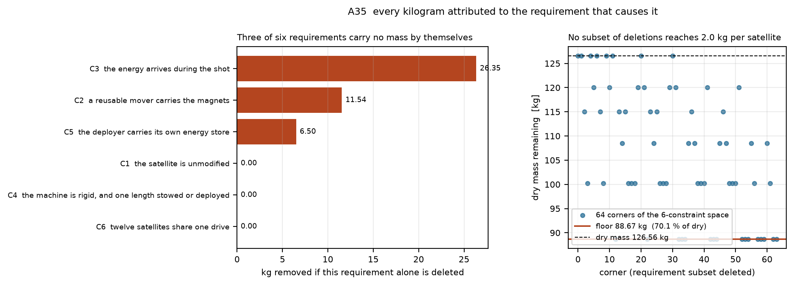

> ## What is generated here, and what is not
>
> **Generated** from [aaaaaaaaaaaavm/VOLLEY](https://github.com/aaaaaaaaaaaavm/VOLLEY) at commit
> `34ebdcd` by `tools/export_companion.py`: the analysis scripts and their results, the
> validation run sheets, the figures, and the reference records. Any edit to those is
> destroyed on the next export. **Fix them in VOLLEY and this repository picks the fix up.**
>
> **Authored here, and never overwritten:** the manuscript and its figures under `source/`, and everything under `university/`. VOLLEY is an engineering
> record and holds no manuscript source.
>
> Where a generated file disagrees with VOLLEY, VOLLEY is right and this copy is stale.
>
> **This repository may be improved until the work is presented, and freezes at that
> moment.** What enters it has to be stable, effective and reliable against the problem
> statement -- not merely newer.

<!-- PROGRAMME-HEADER-START -->
| Repository | Role | You are here |
|---|---|---|
| [VOLLEY](https://github.com/aaaaaaaaaaaavm/VOLLEY) | Main: the authoritative engineering record. Improved continuously |  |
| [VOLLEY-paper](https://github.com/aaaaaaaaaaaavm/VOLLEY-paper) | The concept at its most reliable, as a conference contribution. **Frozen when published** |  |
| **[VOLLEY-thesis](https://github.com/aaaaaaaaaaaavm/VOLLEY-thesis)** | The same concept as a full submission. **Frozen when presented** | ← |
| [VOLLEY-lab](https://github.com/aaaaaaaaaaaavm/VOLLEY-lab) | The vault: ideas that never became a complete thing, and why each stopped |  |
<!-- PROGRAMME-HEADER-END -->

---

# VOLLEY: the thesis

  

  
  

<b>Left:</b> every kilogram attributed to the requirement causing it, then every requirement deleted in all <b>64 corners</b> &mdash; <b>88.67 kg survives all of them</b>, which is why kill criterion 1 is not reachable by architecture. <b>Right:</b> the converged external-aerodynamics solution, with its viscous term <b>bounded rather than solved</b> and said so.

**A final-year thesis on giving rideshare CubeSats an orbit their host was not going to — and
the full record of what went wrong on the way there.**

**[Read the manuscript](source/VOLLEY_IEEE_Conference.pdf)**

The submission is here with its analyses, its acceptance tests and its defect register attached.
The defects are deliberate: an examiner should be able to see what failed, when it was found, and
what was done about it. Nothing in it has been built or measured.

## Layout

| | |
|---|---|
| `source/` | Manuscript and figures |
| `analysis/` | The scripts producing every number in the work |
| `validation/` | The analyses, each with its acceptance bands declared before the run |
| `cad/` | The CAD generations, with the defect audit for each |
| `appendix/` | Baseline, defect ledger, validation report, provenance, prior art, literature, decision records |

## For an examiner, in reading order

1. `appendix/PROVENANCE.md`, which says what stands behind each claim and what does not.
2. `appendix/BASELINE.md`, the frozen values, and the rule for changing any of them.
3. `appendix/adr/`, the decision records. Each states the alternatives considered and the
   consequences accepted. ADR-003 carries its own amendment showing an argument it got wrong.
4. `appendix/OPEN_PROBLEMS.md`, every known defect, including the ones that damage the work's own
   claims — and the ones found by checking this work against itself rather than by anyone asking.
5. `appendix/PRIOR_ART.md`, the nearest published work, and the two claims retracted after reading
   it.

The decision records are the part most worth reading. They are where the reasoning lives, and
several of them record the alternative that was rejected and why.

## What is authored here

`source/` holds the manuscript, which is written in this repository — the main record is an
engineering record and carries no manuscript source. `university/` holds submission forms,
formatting mandates and viva material, which are university-specific and do not belong upstream.
**Neither is ever touched by the export. Everything else is regenerated and will be overwritten.**

This repository may be improved until the thesis is presented, and freezes at that moment. What
enters it has to be stable, effective and reliable against the problem statement.

## The manuscript describes Gen5, and the design target has moved

**This is deliberate and worth stating plainly.** Everything reproduced here is **Gen5** — the
measured baseline, and the record of what a self-contained deployer costs. On 2026-08-14 five
analyses in the main repository replaced the design target: **Gen6 is the payload accelerated
directly, by cold gas, along a rail a spent upper stage provides** (ADR-032). No mover, no
pulse-power chain, no brake, no return stroke.

**Nothing in Gen6 is measured.** Its cradle mechanism does not exist, no launch provider has agreed
to lend a stage, and the seal that owns **98.7 %** of its dispersion has never been on a bench —
which is exactly why the manuscript still carries Gen5. A paper reports what has been analysed to a
declared standard, not what looks best this week.

*Its fluid system is no longer unsized: A56 sized the store at 3.4573 L and 3.1216 kg, ADR-035 chose
the tube material, and A61 specified the seal at 17.8 N. **ADR-036 then suspended the trim stage
rather than building it**, because a seal meeting its own thermal requirement makes the stage
unnecessary — and that decision, like the rest of Gen6, rests on a friction nobody has measured.*

**The main repository carries both**, and the failures at the same standard as the results.

## Before citing

Every number here is a model output. Nothing has been built or measured. The defect ledger is
published deliberately rather than tidied away, and it is the honest measure of how far the work
has actually got.
