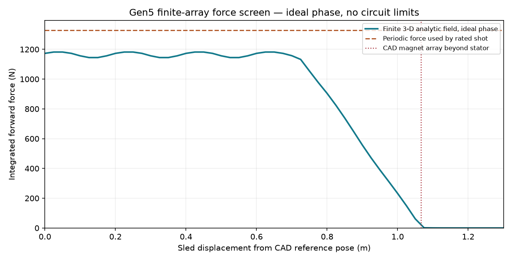
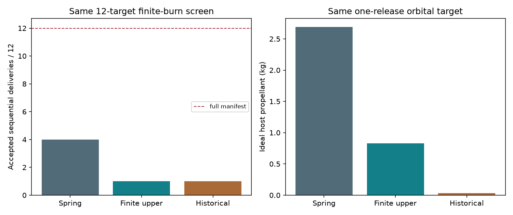
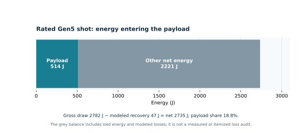
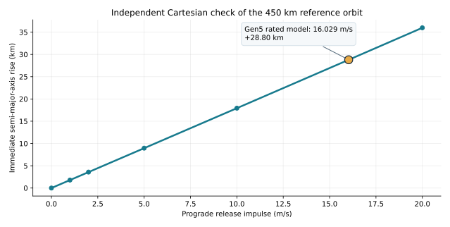
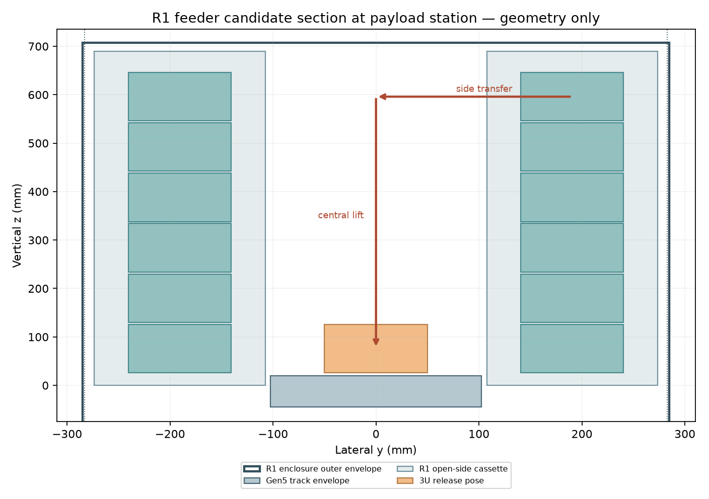
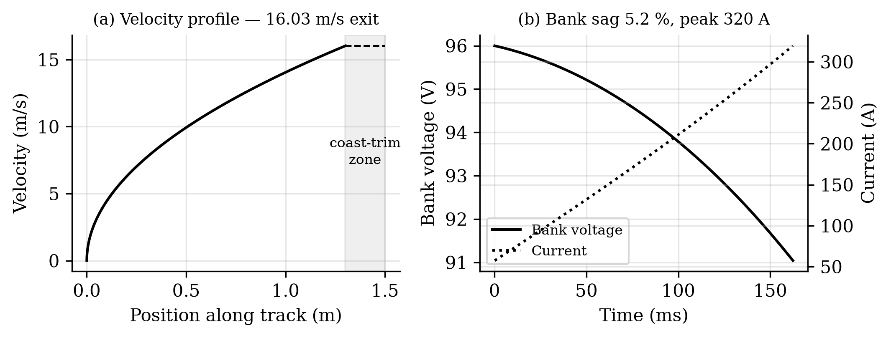

# VOLLEY Gen5 — final-year thesis and review

### A fixed electromagnetic CubeSat deployer design, evaluated by computation

This repository is the **standalone academic record** for VOLLEY Gen5. For the 10 October review, start with [how to present the old numbers and known errors](university/final_review_2026_10_10/READ_THIS_FIRST.md), then download the [offline presentation and evidence pack](university/final_review_2026_10_10/TOMORROW_PRESENTATION_PACK.zip). The repository holds the technical [manuscript](source/VOLLEY_IEEE_Conference.pdf), editable [source](source/paper.tex), model scripts and outputs, CAD, validation sheets, assumptions, defects, and the college [final-review presentation pack](university/final_review_2026_10_10/README.md). A professor can follow a slide claim to a result file and method without opening another repository.

> **Scope, October 2026:** Gen5 is the fixed computational configuration for academic review, with documented model cases and open verification items. It yields a modeled orbital benefit, a failed installed-mass criterion, and a failed side-fed CAD fit. The final academic freeze has not been declared; nothing has been built, fired, measured, qualified or flown. Gen6 is future research toward a 1 km/s-class release; it has no selected architecture or achieved speed.

> **Finding for the examiner:** the finite 3-D analytic force screen gives **12.448 m/s only under ideal phase and omitted circuit losses**, challenging the earlier **16.029 m/s** periodic-model shot. The old value is retained for audit, not presented as established performance. [Method, convergence and limits](validation/P118_gen5_finite_force_map.md) · [affected-claim disposition](docs/GEN5_2026_10_09_FINDING_DISPOSITION.md).

 

*The matched reference uses assumed host and dispenser properties; none of its spring or Gen5 twelve-shot cases closes. [Exact assumptions](docs/MATCHED_MISSION_REFERENCE.md).*

*Model and mission architecture. A host and provider interface have not been selected.*

## Bring this to the final review

| Deliverable | Open it | Evidence route |
|:--|:--|:--|
| **26-slide college presentation** | [PDF](university/final_review_2026_10_10/VOLLEY_Final_Review_2026-10-10.pdf) · [editable PPTX](university/final_review_2026_10_10/VOLLEY_Final_Review_2026-10-10.pptx) | [Slide-by-slide claim map](university/final_review_2026_10_10/CLAIM_EVIDENCE_MAP.md) |
| **Panel handbook** | [PDF](university/final_review_2026_10_10/PANEL_HANDBOOK.pdf) · [Markdown](university/final_review_2026_10_10/PANEL_HANDBOOK.md) | Detailed explanations and figures |
| **Presenter reference** | [PDF](university/final_review_2026_10_10/PRESENTER_REFERENCE.pdf) · [Markdown](university/final_review_2026_10_10/PRESENTER_REFERENCE.md) | Slide notes and viva responses |
| **Final-year project report** | [PDF](university/GEN5_FINAL_YEAR_REPORT.pdf) · [Markdown](university/GEN5_FINAL_YEAR_REPORT.md) | Chaptered academic review draft; college-specific format remains to be applied |
| **Technical manuscript** | [PDF](source/VOLLEY_IEEE_Conference.pdf) · [LaTeX](source/paper.tex) | [Local evidence guide](ACADEMIC_EVIDENCE.md) |
| **Engineering review reports** | [Computational PDF](reports/GEN5_COMPUTATIONAL_REVIEW.pdf) · [FreeCAD/CAD PDF](cad/GEN5_CAD_REVIEW.pdf) | [Orbit check](validation/P115_rated_orbit_cartesian.md) · [Assembly check](validation/P116_gen5_assembly_packaging.md) |

The presentation pack credits **Adityavardhan Mishra and Pratham Chawla**, with guide **Vikas Gulia**. The existing technical manuscript names Adityavardhan Mishra; the review pack does not retroactively change its authorship. [Remaining CAD and IEEE work](IEEE_AND_CAD_REMAINING_WORK.md) · [IEEE prior-art update](IEEE_PRIOR_ART_UPDATE_2026-10-09.md) · [Manuscript claim audit](CLAIM_CORRECTIONS_2026-10-09.md) · [Pack instructions](university/final_review_2026_10_10/README.md) · [Review-pack checksums](university/final_review_2026_10_10/CHECKSUMS.sha256) · [Academic artifact checksums](ARTIFACT_MANIFEST.sha256).

To rebuild the chaptered report from this repository, run `pandoc university/GEN5_FINAL_YEAR_REPORT.md -o university/GEN5_FINAL_YEAR_REPORT.pdf --pdf-engine=xelatex --resource-path=university`. Its source includes the page format and font settings. The college supplied a final-review rubric and example slides, but no mandatory report template; the PDF is an academic review draft awaiting that format and final authorship confirmation.

**Market context for the viva:** [audited customer and spacecraft fit](MARKET_AND_CUSTOMER_FIT.md). It checks the relevant Drive market report and independent business-case review against primary industry sources and the Gen5 result. Candidate buyers and satellite classes are hypotheses, not endorsed customers or qualified payloads.

## The result to defend

Gen5 is one specified system: a release station 1.5 m from the breech on 1.8 m structural longerons, with a 1.3 m powered stroke, ironless double-sided Halbach linear motor, reusable permanent-magnet sled, pulse store, eddy-current arrest and two conceptual cassettes for twelve ordinary 3U CubeSats. The release load and mechanical/electrical compatibility of any actual CubeSat remain unqualified.

 

*Gen5 CAD models. These depict the evaluated geometry; they are not built articles or manufacturing drawings. [Inspect local CAD](cad/).*

| Study question | Modeled Gen5 answer | Examiner's qualification |
|:--|--:|:--|
| Historical rated 3U departure | **16.029 m/s at 10.07 g** | Periodic model challenged by finite geometry; not a measured command range or payload qualification |
| Energy draw | **2.78 kJ gross per shot** | Circuit model at the rated point |
| Exit-speed dispersion | **0.0274 m/s (3σ)** | Simulation under assumed sensor uncertainty |
| Dry / loaded design mass | **126.6 / 174.6 kg** | Modeled rollup with historical Gen3 sled volumes and assumed components, not a complete installed host mass |
| Mass per carried 3U | **10.547 kg** | **Fails** the approximately 2 kg/satellite economic screen |
| Incumbent canister parity | **1.758×** a roughly 6 kg/3U canister | **Fails** the separate ±15% parity band |
| One modeled 450 km orbit case | **28.8 km** semi-major-axis rise; **1.60×** lifetime | Conditional atmosphere and orbit assumptions; current lifetime point lacks an independent rerun |
| Current rated two-body cross-check | **28.800775 km** immediate axis rise | Independent Cartesian propagation; lifetime, host and delivery excluded |
| Side-fed reference assembly fit | **11 mm shortfall** | FreeCAD and CadQuery exact solids collide by 32,915 mm³ per cassette |

[Frozen numerical baseline](appendix/BASELINE.md) · [Claim provenance](appendix/PROVENANCE.md) · [Study limits and viva questions](ACADEMIC_EVIDENCE.md) · [Defect register](appendix/OPEN_PROBLEMS.md)

 

*These review charts are generated by the local [plot script](tools/plot_gen5_decision.py) from [mass](analysis/results/mass_properties.json) and [shot](analysis/results/motor_results.json) outputs. The canister value is approximate; the [P117 algebra audit](validation/P117_rated_energy_mass_audit.md) finds 124.488 J of gross draw unitemized, so the grey energy section is not a closed loss audit.*

 

*The CAD finding is deliberately retained in the [native FreeCAD document](cad/native/Gen5_Review.FCStd) and [assembly STEP](cad/step/gen5/VOLLEY_Review_Assembly_FreeCAD_Gen5.step). The orbit check supports immediate two-body geometry only. [Methods and exact files](reports/GEN5_COMPUTATIONAL_REVIEW.pdf).*

*The [R1 FreeCAD and STEP geometry study](cad/FEEDER_CANDIDATE_R1.md) widens the enclosure and clears twelve scripted 3U envelope paths. Lift actuation, launch retention, tolerances, mass revision and provider compatibility remain open; R1 is not a selected Gen5 configuration.*

  

*Field → shot → mass decision. Independent numerical methods check specific model quantities; none is an experimental Gen5 validation.*

## Method and traceability

| Evidence layer | What is here | What it does not establish |
|:--|:--|:--|
| [Analysis](analysis/) | Executable electromagnetic, shot, mass and orbit models with captured result JSON | Correctness of unknown material, sensor or host inputs |
| [Validation](validation/) | Predeclared acceptance bands, numerical solver cross-checks, failed bands | Hardware repeatability or flight qualification |
| [CAD](cad/) | Gen5 geometry, STEP parts and mass properties | Fabrication readiness, fit to an approved host or full tolerance stack |
| [Appendix](appendix/) | Baseline, prior art, literature, provenance, decisions, defects | External endorsement |
| [Final-review claim map](university/final_review_2026_10_10/CLAIM_EVIDENCE_MAP.md) | Each slide's local evidence and caveat | Replacement for the underlying run sheet |

The analysis and reference files began as a dated engineering snapshot and now include local P115/P116 checks and FreeCAD exports. The manuscript, review pack and this examiner-facing guide are authored here. The local files define the academic claims; a later change in another repository does not silently alter them.

## The academic boundary

The result is a **documented computational study with a negative selection screen for the evaluated 3U configuration**. Integrated thrust, the coupled shot chain, and other engineering closures remain open. The lack of a physical prototype is stated directly; published tests of other devices support context or parameters, not claims that VOLLEY itself was tested. The college rubric includes objectives, technical quality, results/validation, documentation, and presentation/viva. The supplied example deck gives a visual and section outline; it does not supply technical evidence for VOLLEY. [Review-pack rubric mapping](university/final_review_2026_10_10/README.md).

The manuscript uses an IEEE conference layout. A university-specific full-thesis template has not been supplied, and no claim is made that this PDF satisfies an unprovided submission format. The review presentation and academic evidence record are ready for scrutiny of their stated computational scope.

**Beyond Gen5:** [Gen6 direction](university/final_review_2026_10_10/GEN6_DIRECTION.md) frames 1 km/s as a research objective. A named host and ICD, complete installed-system model, payload-specific structural and release testing, repeated shots and full mission closure are future gates. [VOLLEY engineering](https://github.com/aaaaaaaaaaaavm/VOLLEY) and [paper companion](https://github.com/aaaaaaaaaaaavm/VOLLEY-paper) offer optional context; this repository contains the evidence needed to review this thesis.
