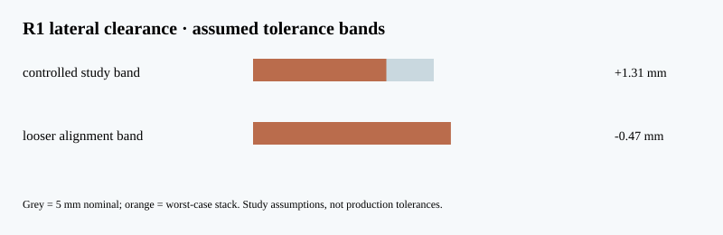

# P126 — R1 feeder lateral tolerance screen

**CAD-derived nominal clearance plus assumed alignment bands; not a released tolerance analysis.**

The exact-solid R1 candidate reports 5.0 mm nominal cassette-to-track
lateral clearance on each side and 9.5 mm nominal
cassette-to-inner-skin clearance. For a 340.5 mm payload proxy, a yaw/roll
alignment angle is converted to lateral sweep as `L tan(angle)`. The worst-case
linear contributions are added, not root-sum-squared.

| Declared study band | Angle | Total stack (mm) | Residual (mm) | Conditional clear? |
|:--|--:|--:|--:|:--:|
| controlled study band | 0.2° | 3.69 | +1.31 | yes |
| looser alignment band | 0.5° | 5.47 | -0.47 | no |

With the declared 2.5 mm linear stack, the angular limit is 0.421°.
A 0.5° misalignment fails the 5 mm nominal corridor in this simple screen.
The actual allowable angle may be lower after gripper, thermal and load margins.

A real release requires datum-controlled part drawings, process capability,
measured payload/interface envelope, full moving-mechanism swept solids and
thermal/structural deflection. The wide R1 assembly remains unselected; Gen5's
original 11 mm side-feed clash is preserved in its baseline evidence.

Reproduce with `python3 cad/screen_feeder_r1_tolerance.py`; `--check` compares
the captured JSON, report and SVG byte for byte.
