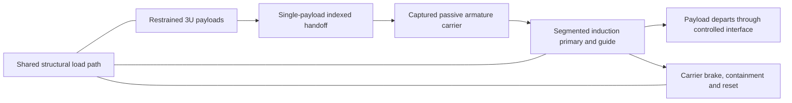

# H1 — whole-system reassessment of a captive passive armature

**Status: unselected research hypothesis, 10 October 2026.** This is a proposed *reassessment* of [VOLLEY-lab PII-19](https://github.com/aaaaaaaaaaaavm/VOLLEY-lab/blob/main/PII-19_induction_drive_legacy_study.md) after the evaluated Gen5 snapshot. PII-19 already used a light captive passive plate and left the spacecraft unmodified. H1 asks whether coupling that old drive idea to a credible shared structure, feed and matched mission changes its whole-system result. It is neither a revised Gen5 performance claim nor the Gen6 1 km/s programme. No H1 CAD, drive rating, twelve-shot trajectory, supplier mass or hardware test exists. No mechanism or patent novelty is claimed.

## Why a motor improvement alone cannot solve the present problem

[P123](../validation/P123_gen5_one_event_mass_screen.md) found a 52.717 kg Gen5 penalty in a narrow one-event device-plus-fuel comparison. The [recomputed necessary bounds](../analysis/results/gen5_architecture_bounds.json) make the decision sharper:

| Same one-event reference | Device mass |
|:--|--:|
| Current modeled Gen5 | 126.562 kg |
| Parity at P118's **ideal** 12.448 m/s | at most 73.932 kg |
| Absolute parity even if a perfect release eliminates the host preburn | at most 74.659 kg |
| Current Gen5 deficit even against that absolute bound | at least 51.903 kg |

The absolute bound is just `D_new + 2 kg reserve <= 72 kg spring device + 4.659253 kg spring one-event fuel`. It assumes zero Gen5 propellant consumption, which is more generous than the current force model. Perfecting the motor changes the allowed dry device mass by only **0.727 kg** relative to the P118 ideal-speed parity figure. Thus a faster shot alone cannot fix this *specific* mass comparison. A different paid mission could change the comparison; it must be demonstrated with the same accounting boundary.

Even the absolute 74.659 kg parity mass is **6.222 kg per carried 3U**, well above the separate 2 kg/3U study economic screen (24 kg total for twelve). Passing canister-class parity and passing the study's economic screen are different decisions. Neither is met by current Gen5.

## Candidate architecture

Keep each CubeSat mechanically and electrically unmodified. Place the conductive secondary on a **captured, reusable carrier** that contacts the spacecraft through a defined standard-rail cradle. A segmented primary accelerates carrier plus spacecraft; a positive end stop and brake retain only the carrier while the spacecraft departs. Integrate the primary, guide and launch-load path into one host-mounted structural cassette instead of counting a separate 50.03 kg enclosure group plus a separate 9 kg bracket without examining shared load paths. The feed mechanism is **not selected**: a center lift and an in-line transfer remain geometry alternatives.

This *would need to* attack several costs together: moving permanent magnets, motor copper outside the active zone, brake energy, duplicated enclosure structure and the side-fed width conflict. PII-19 already showed why reducing the mover alone is insufficient: it was about **11% of dry mass**, while the pulse chain survived. Its segmented drive also left a **30.1% peak-to-peak handover ripple against a 20% band**. H1 additionally faces induction heating, transient edge effects, peak electrical demand, carrier capture shock, field exposure, launch retention and host structural coupling. It cannot be selected from a sketch.

The reason to investigate moving mass is physical, not a predicted redesign result: at the P118 ideal 12.448 m/s, **each kilogram of carrier requires about 77.48 J of ideal kinetic energy and the same amount of arrest energy** if not regenerated. The current 9.445 kg modeled permanent-magnet sled therefore carries about 732 J of ideal kinetic energy at that speed. An H1 carrier has no proven mass; the 0.248 kg conductive plate in [A30](../validation/A30_rail_drive.md) is only an electromagnetic secondary, not a complete restrained, guided and captured carrier. [A31](../validation/A31_plate_drive_normal_force.md) analyzed a plate *on the spacecraft* under steady 2-D assumptions. Its speed and self-centering predictions cannot be transferred to this captive-carrier arrangement.

## What is already prior art

- [Zhao et al., 2022](https://www.mdpi.com/2072-4292/14/17/4205) studied a stacked CubeSat electromagnetic transfer and adjustable release prototype.
- [Feng et al., 2025](https://doi.org/10.1155/ijae/3000765) modeled an induction coilgun and orbital reachable domain.
- [US10538348B2](https://patents.google.com/patent/US10538348B2/en) describes captive satellite restraint and pusher elements; the presence of broad related claims prevents an unsupported novelty assertion here.
- [NASA's ST5 structural review](https://ntrs.nasa.gov/citations/20070016620) documents a multifunctional electronics enclosure and integrated deployment mechanism.
- VOLLEY's own [A30](../validation/A30_rail_drive.md) and [A31](../validation/A31_plate_drive_normal_force.md) already explored plate induction drive. H1's contribution, if one survives the evidence programme, would have to be a **specific validated system integration and trade**, not "electromagnetic deployment," "a pusher," or "a passive armature."
- [VOLLEY-lab PII-19](https://github.com/aaaaaaaaaaaavm/VOLLEY-lab/blob/main/PII-19_induction_drive_legacy_study.md) already proposed a deployer-owned passive plate shuttle, with no spacecraft modification. Its pulse source and installed-mass problem are direct antecedents and must not be hidden by calling H1 a new launcher.

This is an initial source screen, not a freedom-to-operate or exhaustive patent review. The IEEE paper should not describe H1 as a demonstrated invention.

## Hard selection gates

1. **Installed mass and interface:** one complete H1 CAD/BOM must include restraint, carrier, primary, bank, inverter, thermal hardware, harness, brake, mounting and any host reinforcement. Compare standalone and host-integrated accounting without removing mass from both columns. The one-event necessary condition is **at most 74.659 kg** regardless of ideal speed; **73.932 kg** is the stricter P118-speed parity value. A credible design needs margin below the applicable bound. The unchanged 2 kg/3U criterion still corresponds to **24 kg** total.
2. **Geometry and launch loads:** a controlled FreeCAD assembly and STEP set must fit all twelve 3U payloads in an explicitly surrogate or named host envelope, with full restraint, actuator swept solids, worst-case clearances, tolerances and load paths. The current 11 mm clash cannot be hidden by a rendered view.
3. **Electromagnetic and electrical closure:** run transient 3-D finite-width/entry/exit induction force and normal-load sweeps against an independent formulation; couple selected coil, switch, source and hot resistance to motion. Publish current, voltage, force, speed and heat with mesh/time-step convergence and uncertainty. A30/A31 steady 2-D rows are *inputs for falsification*, not H1 ratings.
4. **Release and reset:** model standard-rail contact, tip-off, magnetic exposure, carrier stop, repeated brake heat, jam and abort states. A failed carrier capture must not create an uncontrolled object.
5. **Mission value:** repeat the same twelve-payload target against a qualified spring-class deployment plus competent host manoeuvres. Include installed mass, fuel, pointing, operations, risk and disposal. If no complete mission and resource advantage closes, report H1 as a rejected candidate.

## Decision for the academic record

Freeze the *evaluated* Gen5 study with its failed criteria visible. H1 is a falsifiable successor hypothesis for VOLLEY-Lab, not a replacement for Gen5 results in the current college slides or IEEE draft. The defensible IEEE contribution today is the checked **system-level feasibility finding** and its necessary mass bound. H1 becomes a paper result only after its own geometry, circuit, contact and mission evidence exists.

Recompute the bound with `python3 analysis/gen5_architecture_bounds.py --check`. The input is the existing P123 JSON and Gen5 mass ledger; the output is [this numerical snapshot](../analysis/results/gen5_architecture_bounds.json). No part of the calculation validates H1 hardware.
