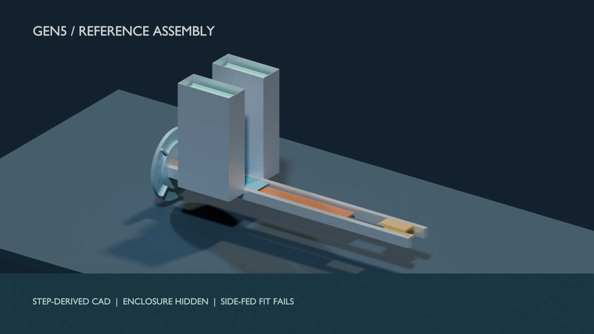
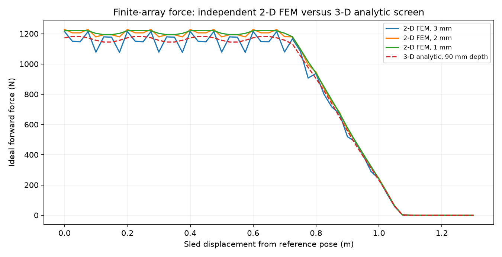

# Abstract

Gen5 is a computational study of a sequential electromagnetic deployer for twelve 3U CubeSats. Its historical periodic-force model gives 16.029 m/s and 10.068 g, but a finite-array calculation challenges that speed; no current motor rating is selected. This report gathers the electromagnetic, power, dynamics, orbit, mass, CAD and mission evidence into a claim-by-claim review. It records decisive failures: 10.547 kg of modeled deployer per 3U customer fails two mass comparisons; a side-fed CAD reference arrangement has an 11 mm width shortfall and exact-solid interference; and no sampled twelve-shot option closes. An independent 2-D finite-element solve confirms the finite-stator trend; a separate depth-resolved 3-D numerical formulation reproduces 1.042 kJ ideal work under shared assumptions. Circuit and selected-hardware effects remain open. The immediate two-body orbit change has a Cartesian check for an assumed historical 16.029 m/s release; the 1.60 lifetime multiplier has no independent rerun at that input. **VOLLEY itself has no built, fired, measured, qualified or flown hardware**.

# 1. Configuration and evidence classes

**New finite-geometry disposition.** The historical 16.029 m/s rating in the table below assumes periodic force over the 1.3 m powered stroke. A [finite-array/stator 3-D analytic integration](../validation/P118_gen5_finite_force_map.md) gives 1.042 kJ ideal work and a 12.448 m/s geometry-only speed under optimal phase with circuit losses omitted. The modeled magnet array has no direct stator overlap after 1.066 m travel. This challenges the rated performance claim and is not an independent FEM or hardware validation. The [unselected R1 FreeCAD feeder candidate](../cad/FEEDER_CANDIDATE_R1.pdf) clears twelve scripted envelope routes in a widened 570 mm enclosure, but no actuator, restraint or revised installed-system budgets exist. A [matched reference mission](../docs/MATCHED_MISSION_REFERENCE.md) includes dispenser mass and host recoil; no sampled twelve-shot option closes. These findings have not been rolled into the original rated shot, mass or lifetime models.

{width=95%}

*Figure: FreeCAD-linked STEP geometry visualized in Blender. The enclosure is hidden; this is neither photographed hardware nor a manufacturing release. [Source and image provenance](../cad/renders/step_review/README.md).*

An [independent 2-D finite-element solve](../validation/P119_gen5_finite_force_fem2d.md) uses a vector-potential PDE, finite seven-wavelength arrays and the drawn 162-belt stator. Its 1 mm mesh gives **1,081.6 J ideal in-plane work**, compared with 1,041.7 J from the 3-D analytic screen. The 2-to-1 mm mesh change is 0.59%. This supports the end-of-stator force decline by a different field method; the 2-D solve omits magnet-depth end effects and is not a 3-D motor validation.

The [P121 independent depth-resolved 3-D surface-charge implementation](../validation/P121_gen5_finite_force_surface3d.md) calculates the full finite-depth cuboid field and integrates all 162 belts without calling the P118 field code. It finds **1,041.7 J ideal work**, agreeing with P118 to 4.35e-08%; face quadrature changes work by 0.00002% from 16 to 24 nodes and station refinement changes it by 0.096%. Seven independent air-field probes differ by at most 0.00002%. These close a numerical formulation check under shared magnetization, geometry and ideal-phase assumptions. They are not a 3-D FEM, a selected motor or measurement.

The [P122 deterministic sensitivity sweep](../validation/P122_gen5_finite_force_sensitivity.md) gives **906.7 J at 14 mm face gap** versus 1,041.7 J at 12 mm, a 13.0% ideal-work decrease. A 16 mm gap gives 789.9 J; a 10 mm copper depth offset gives 961.2 J. These are illustrative perturbations, not supplier or fabrication tolerances, and do not define an achievable release speed.

The [P120 finite-force shot rerun](../validation/P120_gen5_finite_coupled_shot.md) interpolates P118's position-dependent force through the assumed historical 96 V/6 F/12 mΩ bank and converter equations. With the full 1.3 m winding energized it gives **12.448 m/s and 2,098.6 J gross draw**; with a hypothetical 0.34 m active-copper length it gives **1,394.4 J** at the same ideal speed. Those two electrical branches are not selected hardware. The old 2.782 kJ, 47 J recovered, brake and dispersion results cannot be carried across without new models and interfaces.

The [configuration index](../docs/GEN5_CONFIGURATION_INDEX.json) hashes the eight source STEP parts, the FreeCAD exports and native document, geometry parameters, governing model code and result files. Its status is `COMPUTATIONAL_DESIGN_REVIEW_CANDIDATE`; identity of files is not proof that an equation or material assumption is correct. The reference host is a 450 km circular orbit with a tangential prograde impulse for the orbital comparison, not a provider-approved mission. No named flight CubeSat, provider ICD or full installed system exists.

This report distinguishes **model output**, **independent numerical cross-check**, **prior-art support**, and **physical measurement**. The last class is empty for Gen5. A plot exported by a Python model is not a screenshot of a solver or an experimental trace. The CAD views are B-rep visualizations. The [figure evidence index](../docs/FIGURE_INDEX.md) and individual run sheets identify each image's source.

# 2. Historical machine and electrical result

| Quantity | Historical model value | Boundary |
|:--|--:|:--|
| Exit speed, 3U | 16.029 m/s | Historical periodic-model operating point, challenged by finite geometry |
| Peak acceleration | 10.068 g | Payload load not qualified |
| Gross / net electrical draw | 2782.391 / 2735.3 J | Coupled circuit/dynamics model |
| Net electrical-to-payload efficiency | 18.79% | Modeled recovery and losses |
| Closed-loop exit-speed dispersion | 0.0274 m/s, 3σ | Simulated sensor/uncertainty assumptions |
| Modeled dry / loaded mass | 126.6 / 174.6 kg | Assumed and geometry-derived lines mixed |

The shot trace below comes from `analysis/motor_model.py` and the checked-in model result. It is not an oscilloscope capture. The field plot is from the declared analytical field builder; P121 separately checks the ideal full-depth force integral under shared linear magnetic assumptions. Hot winding resistance, inverter switching, full bank supplier data and protection remain unresolved.

\begin{center}
\includegraphics[width=0.74\linewidth]{../figures/F01_shot.png}\\
\small Figure 1. Historical modeled shot profile; source: motor model, evidence class M.
\end{center}

\begin{center}
\includegraphics[width=0.73\linewidth]{../figures/A02_field_map.png}\\
\small Figure 2. Calculated Gen5 magnetic field; this does not measure integrated thrust.
\end{center}

A separate [historical energy and mass algebra audit](../validation/P117_rated_energy_mass_audit.md) reproduces the 4.000 kg/payload inference, 513.858 J payload kinetic energy, 1.30075 m constant-acceleration equivalent stroke, and rounded brake/recovery identities from the captured JSON. The old **124.488 J** compact-output remainder resolves into **90.964 J modeled converter loss, 32.460 J auxiliary draw and 1.064 J forward-Euler integration excess**, leaving less than 0.001 J after reported rounding. This closes the old model's arithmetic, not a supplier-backed source or a circuit-coupled finite-force shot.

# 3. Orbit, timing and complete-manifest checks

For a 450 km circular host reference, an **assumed historical 16.029 m/s** instantaneous tangential impulse gives a **28.800775 km** semi-major-axis rise in the [separate Cartesian DOP853 propagation](../validation/P115_rated_orbit_cartesian.md). The two-body numerical band is 0.02 m and passes. This confirms immediate orbital geometry for that assumed state. It does not independently establish the stated **1.60 lifetime multiplier**, which depends on a static atmosphere at mean activity and has no independent rerun at that input. It does not establish thrust, finite release duration or host acceptability.

\begin{center}
\includegraphics[width=0.78\linewidth]{../figures/rated_orbit_crosscheck.png}\\
\small Figure 3. Independent two-body geometry response; sweep points are not a Gen5 command envelope.
\end{center}

Timing alone from an unchanged host with zero relative release impulse creates no persistent same-epoch phase offset. The prior 468-second/30-degree claim is withdrawn. The six sampled finite-burn campaigns with a twelve-payload manifest return accepted prefixes of **0, 3, 4, 0, 4 and 5**; no sample delivers all twelve. These are bounded surrogate cases with assumed host thrust and rules, not a proof that no mission can close. Spring impulse, spring plus host manoeuvres, onboard propulsion and orbital transport still require matched provider/payload mission comparison.

# 4. Mass and CAD decision

The modeled dry mass is **126.6 kg**, including an A46 enclosure build-up, assumed components, and a 9.445 kg sled from historical Gen3 solid volumes. For twelve 3U payloads this is **10.547 kg per customer**. It misses the project's approximately 2 kg/customer economic screen and is **1.758 times** an approximate 6 kg/3U spring-canister comparator, outside a separate ±15% parity band. The 64-corner mass ledger's most favorable evaluated requirement-deletion case remains 88.67 kg. These comparisons are screening assumptions, not supplier quotes.

The [FreeCAD 1.0 CAD review](../cad/GEN5_CAD_REVIEW.pdf) releases a native `.FCStd` document, eight FreeCAD-exported STEP parts and a 20-instance assembly STEP. The side-fed reference placement fails: 526 mm internal width versus 537 mm for track and cassettes before clearance. Both CadQuery and FreeCAD find **32,915 mm³** exact-solid track/cassette overlap per side. The clash is left in the native project for inspection. It may be remedied only by a new feeder/enclosure configuration and renewed analysis; the existing design cannot be called mechanically complete.

\begin{center}
\includegraphics[height=0.38\textheight]{../figures/gen5_packaging_section.png}\\
\small Figure 4. Dimension-derived cross-section and exact-solid clash. Reference placement, not a production drawing.
\end{center}

# 5. Evidence closure and review decision

The [C-00–C-20 freeze register](../docs/GEN5_FREEZE_READINESS.md) is the authority for each unresolved question. A dated clean-snapshot gate run passed 148 tests and left tracked files clean; that gate does not rerun all native FEM, SPICE, GMAT or CAD studies, and companion files were unavailable inside that isolated snapshot. P121 checks the ideal full-depth force by a second numerical formulation; P115 and P116 reduce uncertainty on immediate two-body orbit geometry and expose a mechanical packaging failure. They do not close a selected bank/inverter, release contact, brake arrest/reset, moving-load structure, magnetic payload compatibility, thermal cycling, provider integration, disposal or complete mission delivery.

The college rubric calls for achievement of objectives, technical quality, validation, documentation and demonstration. It offers special recognition for a working prototype; it does not make a prototype a stated prerequisite for all 40 final marks. A professional final review should demonstrate the reproducible models and native CAD, show the failed criteria prominently, and explain what a later physical programme must measure. A literature analogy or polished render must not be described as a Gen5 physical validation.

**Release decision:** Gen5 is a documented computational design study with an unresolved internal performance discrepancy and negative 3U mass/fit findings. It is **not** a complete deployer product, a provider-approved flight design, or a final evidence freeze. Gen6's 1 km/s-class objective remains a distinct research direction; it cannot repair a failed Gen5 criterion by changing the label.

# Reproduce and audit

From a clean checkout, install the pinned or declared Python dependencies, run `./tools/verify_all.sh`, then inspect its report and the exact source/result hashes. Rebuild the new orbit figure with `python3 analysis/rated_orbit_independent.py`. Rebuild the Gen5 STEP parts with `python3 cad/build_gen5.py --check`, the reference assembly with `python3 cad/build_review_assembly.py`, and the native handover with `/usr/bin/python3 cad/freecad_export_review.py` on FreeCAD 1.0. See [P115](../validation/P115_rated_orbit_cartesian.md), [P116](../validation/P116_gen5_assembly_packaging.md), the [CAD PDF](../cad/GEN5_CAD_REVIEW.pdf) and the [market/customer audit](../MARKET_AND_CUSTOMER_FIT.md) for source-specific limits.
