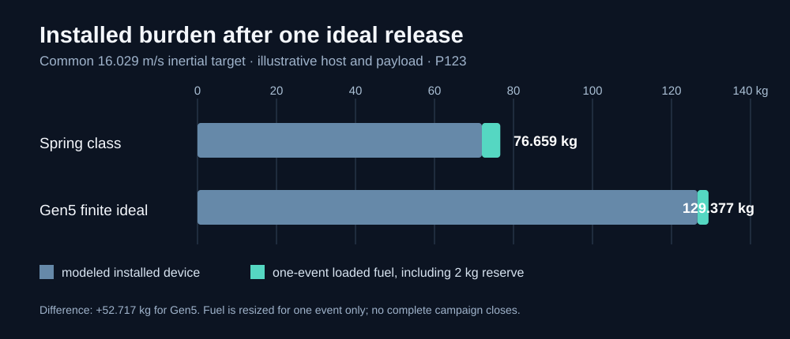

# P123 late finding — examiner handout

**10 October 2026 supplemental computation.** The presentation PPTX, PDFs and report in this folder are the prior controlled review snapshot. This note records a later, reproducible *one-event* mass screen. It does not change their numbers or declare an academic freeze.

## Say this in the review

> “We compared the same 12-payload reference host and inertial target against a spring-class dispenser. At Gen5's optimistic finite-geometry speed conversion, the host uses 1.866 kg less fuel for one ideal release if both start with 10 kg. But our modeled Gen5 device is 54.562 kg heavier. When we re-solve the fuel required for that one event plus the same reserve, Gen5 is still 52.717 kg heavier on the narrow device-plus-fuel proxy. So we do not claim system-level mass advantage. We now have a quantified design target for the next revision.”

The **16.029 m/s** printed in older material is a *common inertial mission target* in this comparison, not a demonstrated Gen5 release speed. The finite-force **12.448 m/s** is itself an optimistic ideal-field work-to-speed conversion, not a selected winding/inverter rating.

## If the panel asks

| Question | Defensible answer |
|:--|:--|
| “Is Gen5 finished?” | It is a controlled computational **review candidate** with reproducible models and explicit failed criteria. The final academic freeze, physical build and qualification are not complete. |
| “Does the faster release save the mission?” | Not shown. This one-event fuel saving is smaller than the modeled installed-mass penalty; the sampled twelve-release campaigns also do not close. |
| “What would you redesign?” | First close an actual drive circuit and credible feed/restraint/brake. The one-event parity screen requires about 52.630 kg less device mass at the same *ideal* conversion, about 41.6% of the current modeled 126.562 kg. No feasible redesign has demonstrated that cut. |
| “Can you remove the enclosure?” | Its five listed related entries total 50.03 kg. Removing all would still miss the narrow parity threshold by about 2.60 kg, and would destroy containment, thermal and interface functions. A real revision needs a multi-subsystem trade and new analyses. |
| “What validates this?” | The exact algebra is in [P123](../../validation/P123_gen5_one_event_mass_screen.md), with [Python source](../../analysis/gen5_one_event_mass_screen.py) and [committed JSON](../../analysis/results/gen5_one_event_mass_screen.json). It checks equations and assumptions only; no physical VOLLEY test exists. |
| “What could the IEEE paper contribute?” | A bounded system-level feasibility result with independent model checks, convergence, installed burden and adverse findings, once full prior-art and reviewer checks are complete. |

If the panel asks for the detailed figures, open the [local P123 run sheet](../../validation/P123_gen5_one_event_mass_screen.md). The published report and slides should be revised from one controlled snapshot before final submission; this addendum is a review aid, not an unrecorded replacement.
