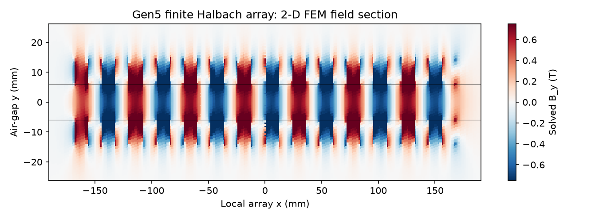

# P119 — independent 2-D finite-array force screen

**Evidence class: exploratory 2-D finite-element model; not a 3-D force or hardware validation.**

The finite 7-wavelength, double-sided Halbach array is solved as a triangular-mesh
magnetostatic vector-potential problem using scikit-fem P1 elements. Magnet remanence,
gap and dimensions match `cad/parameters.json` and `analysis/motor_model.py`. The
resulting field is integrated through the 162 drawn stator belts with the P118 phase
convention, selecting ideal phase independently at each 25 mm position. The PDE solver
does not use magpylib's cuboid field law; the geometry and material assumptions are shared.

The 1 mm mesh has 135,401 nodes and 268,800 triangles.
Its ideal work is **1081.6 J**, or **12.684 m/s**
when converted with the same 13.445 kg moving-mass assumption. This is a 2-D result
with no magnet-depth end effect, circuit loss, friction or contact dynamics.
P118's 3-D analytic screen gives 1041.7 J; the
methods agree on the substantial end-of-stator force decline, but the absolute works
are not identical models and must not be averaged into a selected speed rating.

| Mesh size | Nodes | Ideal work | Speed conversion |
|:--|--:|--:|--:|
| 3 mm | 15,174 | 1033.2 J | 12.397 m/s |
| 2 mm | 34,101 | 1075.2 J | 12.647 m/s |
| 1 mm | 135,401 | 1081.6 J | 12.684 m/s |

The 2-to-1 mm work change is 0.59%. 
At 2 mm, enlarging the air box from ±0.42×0.08 m to ±0.55×0.12 m changes work by
0.0004%; expanding the force
sampling window changes it by 0.0003%.
At x=6 mm, midgap B_y is -0.692877 T versus
-0.694207 T from magpylib (difference 0.19%).
These are numerical diagnostics set out with this exploratory run, not pre-registered
acceptance bands or measured magnetic-field accuracy.

The complete 3-D integrated force, a coupled winding/inverter trajectory, feed and
release contact, and actual payload/host limits remain open. The field plot is a
software-generated solver visualization, not an interactive GUI screenshot.

Reproduce with `python analysis/gen5_finite_force_fem2d.py` after installing
`requirements-dev.txt`. Result, software, source and parameter hashes are in
`analysis/results/gen5_finite_force_fem2d.json`.
