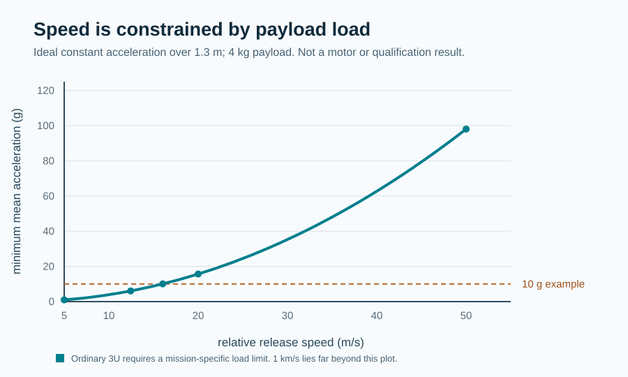

# P124 — precision-delivery design-space screen

**Result type:** exact ideal two-body orbital-energy conversion and minimum constant-acceleration stroke screen. This is a *requirements aid*, not a Gen5 rated-performance result or evidence of command precision.

The customer job is a specified payload state and tolerance at an agreed epoch. Release speed alone is not that service: host state, direction, recoil, navigation, timing, repeatability, collision avoidance and disposal matter. The table assumes a 450 km circular Earth orbit and a purely prograde *inertial* increment; a real commanded relative release needs host momentum and attitude treatment.

## Orbital state sets the speed and accuracy problem

| Ideal axis-rise target | Required inertial tangential increment | ±axis band | Smaller-side increment margin |
|--:|--:|--:|--:|
| 1.0 km | 0.559 m/s | ±0.1 km | 0.0559 m/s |
| 1.0 km | 0.559 m/s | ±1.0 km | 0.5592 m/s |
| 5.0 km | 2.795 m/s | ±0.1 km | 0.0558 m/s |
| 5.0 km | 2.795 m/s | ±1.0 km | 0.5584 m/s |
| 10.0 km | 5.585 m/s | ±0.1 km | 0.0557 m/s |
| 10.0 km | 5.585 m/s | ±1.0 km | 0.5573 m/s |
| 20.0 km | 11.149 m/s | ±0.1 km | 0.0555 m/s |
| 20.0 km | 11.149 m/s | ±1.0 km | 0.5553 m/s |
| 28.8 km | 16.029 m/s | ±0.1 km | 0.0554 m/s |
| 28.8 km | 16.029 m/s | ±1.0 km | 0.5535 m/s |
| 50.0 km | 27.720 m/s | ±0.1 km | 0.0549 m/s |
| 50.0 km | 27.720 m/s | ±1.0 km | 0.5493 m/s |

The margins above allocate the **entire** semimajor-axis error to velocity magnitude. A real requirement must split that budget among host navigation, release vector, speed, epoch, propagation and tracking. It must also specify along-track/plane/perigee tolerances; semimajor axis alone is not precision delivery.

## Stroke and payload-load screening

| Relative speed | Minimum mean acceleration over 1.3 m | Payload kinetic energy at 4 kg | Ideal stroke at 10 g |
|--:|--:|--:|--:|
| 2.500 m/s | 0.2 g | 12 J | 0.03 m |
| 5.000 m/s | 1.0 g | 50 J | 0.13 m |
| 12.448 m/s | 6.1 g | 310 J | 0.79 m |
| 16.029 m/s | 10.1 g | 514 J | 1.31 m |
| 20.000 m/s | 15.7 g | 800 J | 2.04 m |
| 50.000 m/s | 98.0 g | 5,000 J | 12.75 m |
| 1000.000 m/s | 39,219.9 g | 2,000,000 J | 5,098.58 m |

At the 1.3 m *full usable stroke* idealization, the 10 g ceiling permits only 15.97 m/s; actual profiles may peak higher. A 1 km/s release of an ordinary 4 kg 3U payload would require 39,220 g and 2.0 MJ payload kinetic energy over that stroke, or 5.10 km at 10 g. These are kinematic necessities; conversion losses, magnetic force and brake energy increase the system burden. A 1 km/s-class goal cannot be inherited as a credible first Gen6 prototype requirement for an ordinary 3U on the Gen5 stroke.

P118's 12.448 m/s finite-force value is an *ideal motor-energy conversion*, not a demonstrated relative command. If it were entirely inertial and prograde from the reference orbit, it would yield 22.34 km immediate semimajor-axis rise. Actual host recoil and preburn must be modeled before using that number in a mission.

The old 0.0274 m/s (3σ) simulated release dispersion would correspond to about 49.5 m of two-body axis halfwidth **only if** it transferred unchanged to the challenged 16.029 m/s point and all error were tangential. It has not been measured or transferred to P118, and does not establish payload delivery accuracy.

## Product and prototype decisions

1. Derive a first Gen6 prototype's speed *and accuracy* requirements from a named customer state, tolerance, payload acceleration limit and host/provider interface. Use a lower-speed 3U engineering demonstrator until those are known. Keep 1 km/s as a separate long-range, payload-specific research question with a new stroke and load architecture.
2. Set one common-epoch mission benchmark with springs plus competent host maneuvers and VOLLEY. Count installed mass, host resources and failures. The existing P123 one-event comparison is unfavorable to Gen5, and the sampled twelve-shot case does not close.
3. Verify commanded range, direction and repeatability with a selected drive and mechanisms model; then test a calibrated physical prototype. Analytic orbital sensitivity is a requirement generator, not a measurement.

Reproduce with `python3 analysis/precision_delivery_design_space.py`; `--check` verifies the committed result and figure. The JSON contains the constants, assumptions and unrounded numbers.
