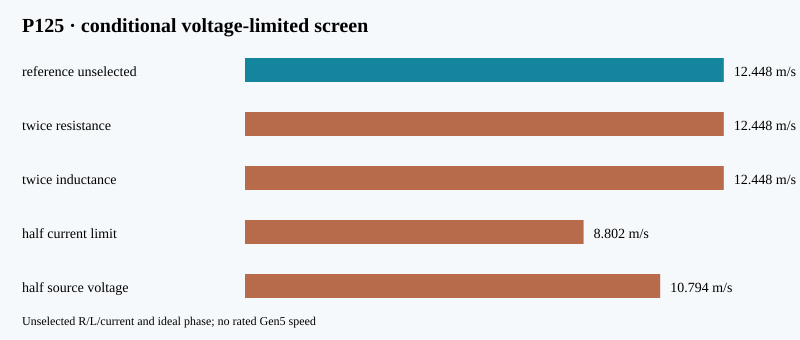

# P125 — voltage and current feasibility screen

**Conditional numerical screen, not a selected motor, rated speed or hardware validation.**

P118's position force map is scaled by phase current. A balanced three-phase
power identity gives `E_peak = Fv/(1.5 I_peak)`. At each time step the model
caps the current where `sqrt((E+RI)^2+(ωLI)^2)` reaches `Vdc/√3`, and
integrates capacitor droop and ESR. The resistance, inductance and peak current
come from the historical periodic-winding calculation; they are **not selected parts**.
Ideal space-vector modulation and instantaneous q-axis current are assumed.

| Surrogate case | Exit speed (m/s) | Cap draw (J) | Steps voltage limited / failure |
|:--|--:|--:|--:|
| reference unselected | 12.448 | 2149 | 0.0% |
| twice resistance | 12.448 | 3169 | 0.0% |
| twice inductance | 12.448 | 2149 | 0.0% |
| half current limit | 8.802 | 949 | 0.0% |
| half source voltage | 10.794 | 1796 | 37.0% |
| legacy commercial low esr | **fails at 0.612 m** | — | source power limit |
| legacy commercial high esr | **fails at 0.160 m** | — | source power limit |
| two parallel low esr | 12.448 | 2340 | 0.0% |
| three parallel high esr | 12.448 | 2357 | 0.0% |

The 116–185 mΩ source range is an **older distributor-data bound**, not a
manufacturer-qualified cell selection; see `validation/A10_bank_esr.md`.
The model solves the source power quadratic at each step and reports failure
when demanded terminal power exceeds `Vcap²/(4 ESR)`. Source ESR and
capacitance are varied independently here; an actual cell string couples them.

The two- and three-parallel-string branches scale capacitance and divide
ESR together as ideal identical strings. They also multiply cell count and
source mass; busbars, balancing, current limits and actual cell ratings are
unselected. A completed numerical branch is not a buildable bank.

Reference step refinement (0.2–0.05 ms) changes exit speed by at most 0.0000 m/s.
Reference energy-ledger residual is -0.0280 J.
This step check does not cover force-map interpolation, winding tolerance or source uncertainty.

The decisive motor gate remains open: select and document a winding, switching
stage and pulse source, then run switched-current and thermal cases against
their data-sheet limits. Voltage-limited speed here is an engineering sensitivity
to *assumed* components. No release speed or command precision is established.

Reproduce with `python3 analysis/gen5_voltage_limited_screen.py`; `--check`
compares the committed JSON, report and SVG byte for byte.
