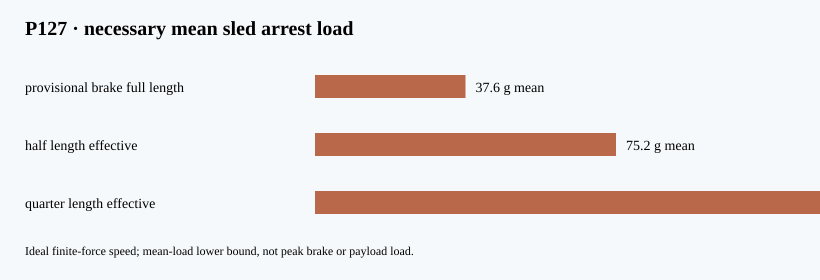

# P127 — ideal finite-force release and arrest bounds

**Necessary momentum and energy screen only. No brake, host or payload qualification.**

P118's ideal 12.448 m/s speed and the 9.445 kg CAD-derived sled
imply 731.8 J of sled kinetic energy and 117.6 N·s
of sled arrest impulse, if no regeneration is credited. Twelve identical shots
would put 8781.8 J into arrest pathways before cooling or
energy recovery. This does not establish where heat is deposited.

The provisional CAD brake runs from 1530 to 1740 mm
(210 mm). Required **mean** force and deceleration are:

| Effective stop corridor | Length (mm) | Mean force (N) | Mean deceleration (g) |
|:--|--:|--:|--:|
| provisional brake full length | 210.0 | 3485 | 37.6 |
| half length effective | 105.0 | 6970 | 75.2 |
| quarter length effective | 52.5 | 13939 | 150.5 |

At the provisional 200 g sled cap, constant deceleration
would need at least 39.5 mm. A mean below 200 g cannot prove
a peak below 200 g: eddy entry, speed dependence, mechanical stop and
compliance must be solved on the same CAD revision.

For the declared 484.600 kg first-shot reference mass, a fixed-frame
momentum screen gives 0.345 m/s host reaction during
payload-plus-sled acceleration, 0.243 m/s recovery during
sled arrest, and 0.103 m/s net from payload departure.
This is neither an orbit prediction nor an attitude/stability analysis;
mounting lever arm, host inertia, release contact and host control are omitted.

Reproduce with `python3 analysis/gen5_release_arrest_bounds.py`; `--check`
compares JSON, report and figure. The source hashes bind the calculation
to the committed P118 result, CAD brake dimensions and mass ledger.
